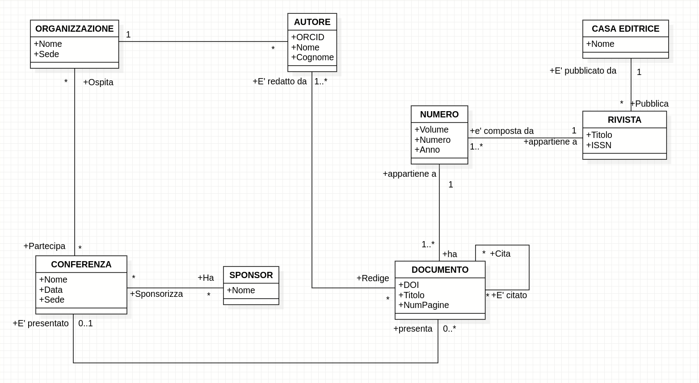
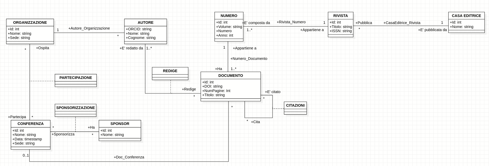

# Database bibliografico e bibliometrico

Si vuole sviluppare una base di dati relazionale, sul modello di servizi quali
Scopus​ o Web of Science​ , in grado di memorizzare informazioni
bibliografiche di base su pubblicazioni scientifiche (autori, titolo, tipo di
contributo, titolo rivista/volume ecc.) e citazioni, in modo da poter
ricostruire la bibliografia di ogni pubblicazione e calcolare parametri
bibliometrici come l'​ indice H​ di ogni autore.

## Class Diagram

## Class Diagram Ristrutturato

